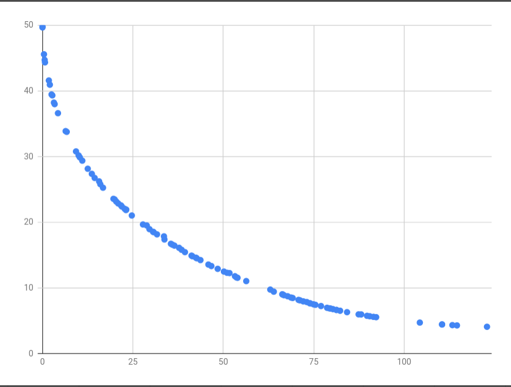

# Overview

This example implements optimisation for Binh-Korn function as seen
[here](https://en.wikipedia.org/wiki/Test_functions_for_optimization#Test_functions_for_multi-objective_optimization).

# Usage

To run the optimisation, run:

```shell
cargo run --bin=binh-korn
x          | y          | f1(x, y)   | f2(x, y)  
===============================================
1.5592     | 1.8278     | 23.0882    | 21.9018   
0.3450     | 0.0876     | 0.5069     | 45.8005   
2.2604     | 2.1695     | 39.2656    | 15.5168   
1.5999     | 1.9876     | 26.0412    | 20.6352   
1.3966     | 1.6003     | 18.0457    | 24.5426   
2.4750     | 2.1532     | 43.0477    | 14.4799   
1.1774     | 1.3379     | 12.7046    | 28.0235   
2.2567     | 1.8551     | 34.1363    | 17.4161   
1.0995     | 1.0792     | 9.4950     | 30.5859   
1.3839     | 1.7436     | 19.8211    | 23.6804
```

You can specify an optional number of samples to print (default is 10):
```shell
cargo run --bin=binh-korn 3
x          | y          | f1(x, y)   | f2(x, y)  
===============================================
2.6960     | 2.3138     | 50.4884    | 12.5241   
2.4421     | 2.2675     | 44.4221    | 14.0093   
1.5487     | 1.6622     | 20.6451    | 23.0526
```

# Visualising results

The `f1(x, y)` and `f2(x, y)` values can be plotted to show a nice Pareto front:
